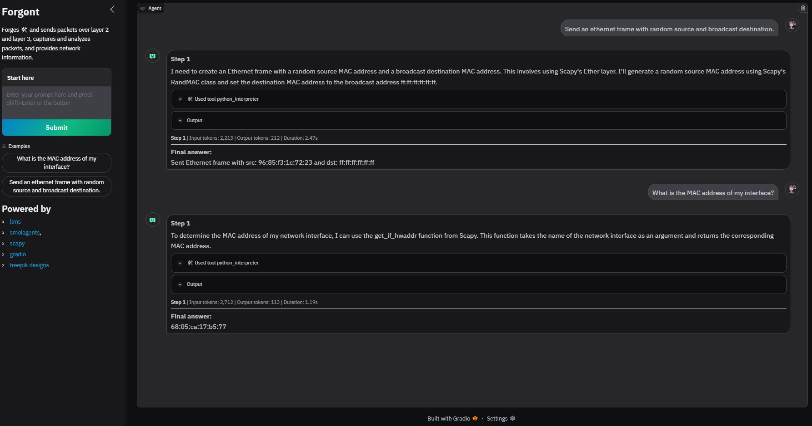

## Introduction
Forgent is an interactive agent-based network packet analysis and forging tool. It leverages large language models, Scapy, and Gradio to provide a conversational interface for capturing, crafting, sending, and analyzing network packets. Forgent is ideal for network engineers, security researchers, and educators who want to automate or experiment with network tasks using natural language.

## Installation
1. Clone this repository:
   ```sh
   git clone https://github.com/yourusername/forgent.git
   cd forgent
   ```
2. (Recommended) Create and activate a Python virtual environment:
   ```sh
   python -m venv .venv
   # On Windows:
   .venv\Scripts\activate
   # On macOS/Linux:
   source .venv/bin/activate
   ```
3. Install the required dependencies:
   ```sh
   pip install -r requirements.txt
   ```
   Or, using [uv](https://github.com/astral-sh/uv) (recommended for speed):
   ```sh
   uv pip install -r requirements.txt
   ```

4. Basing on your LLM provider
   - Fill the `settings.yaml` file the model id and api base URL. Checkout https://docs.litellm.ai/docs/ for more details.
   - Set the API_KEY in environment variables or in the `.env` file. 

## Usage
0. Ensure you have the necessary permissions to capture and send raw packets on your network interface. Otherwise forgent will exit with an error.
1. Run the main application:
   ```sh
   python main.py
   ```
2. Select the network interface index when prompted based on Index column.
3. A default browser tab will be opened with the Forgent web UI.
4. Start interacting with the agent by the example prompts provided in the UI or by entering your own commands.

## Gallery


## Contributing
Contributions are welcome! Please open issues or pull requests for bug fixes, features, or improvements.

## License
This project is licensed under the MIT License. See [LICENSE](LICENSE) for details.